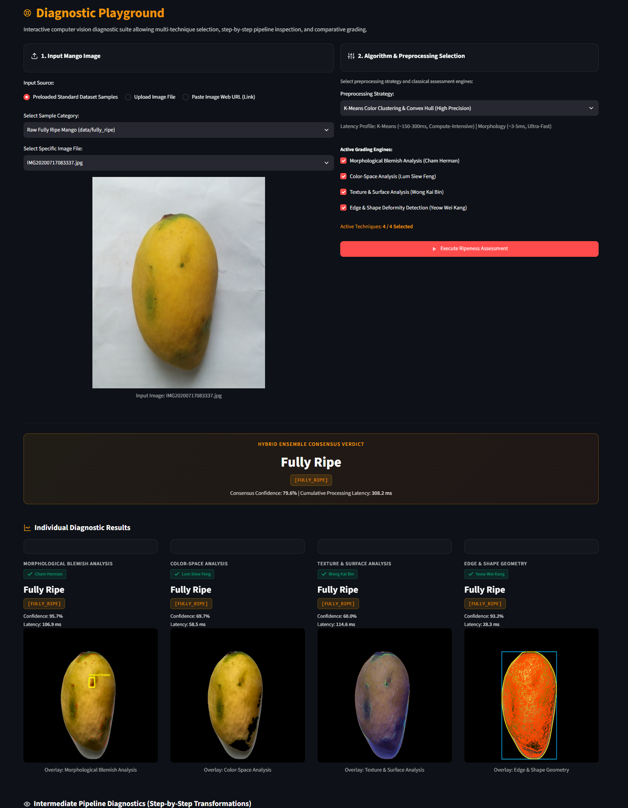
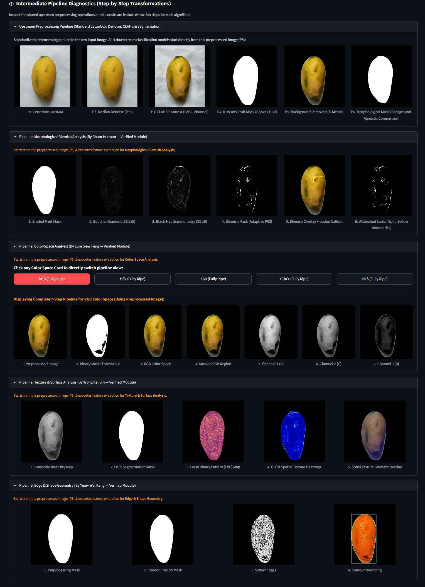
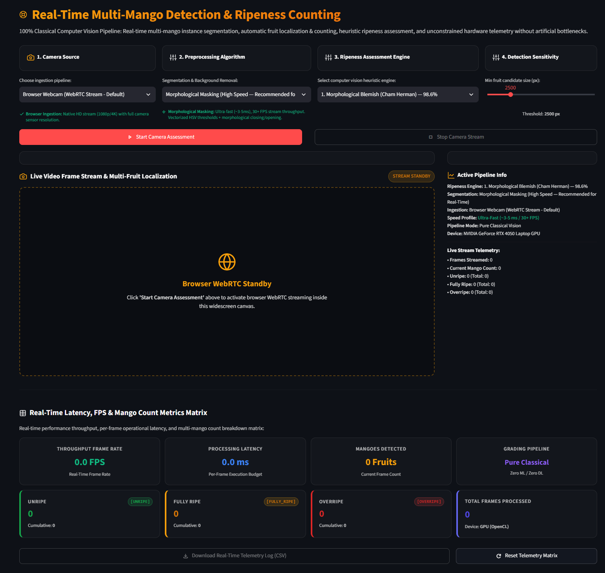
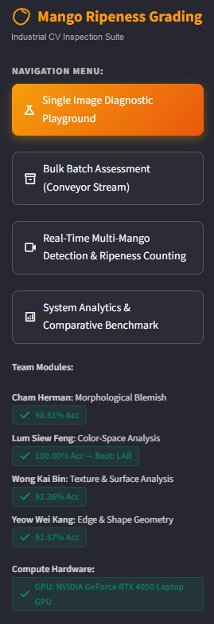
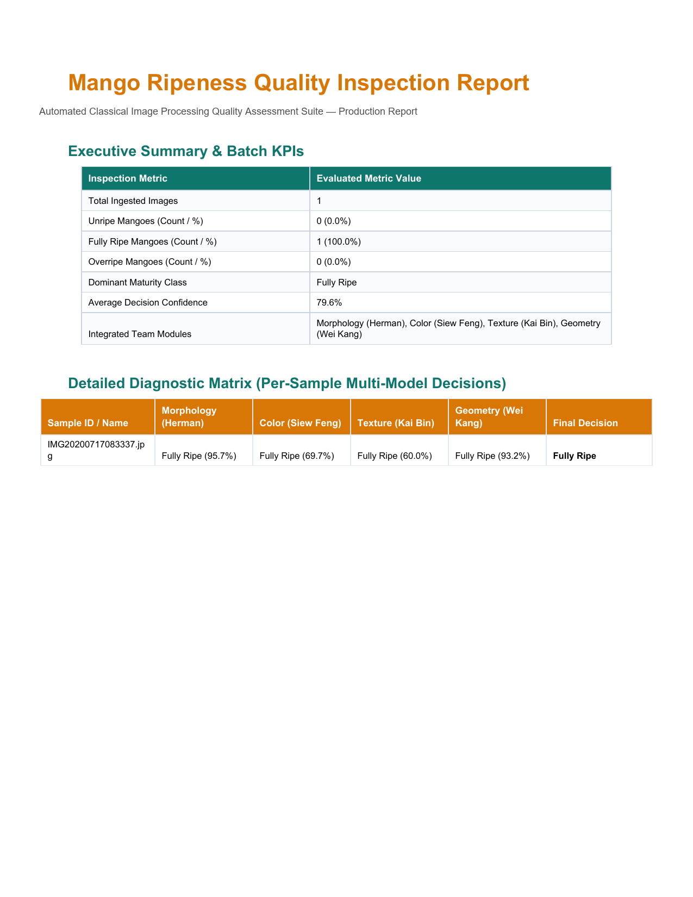

<div align="center">
  <a href="https://github.com/ChamHerman/mango-ripeness-grading">
    
  </a>
  <h1 align="center">Mango Ripeness Grading</h1>
  <a href="https://git.io/typing-svg">
    
  </a>

  <p align="center">
    <strong>An industrial-grade classical computer vision and image processing suite for automated ripeness grading, multi-spectral feature fusion, real-time conveyor tracking, and batch quality certification of mango fruits (<i>Mangifera indica</i>).</strong>
  </p>

  <p align="center">
    <a href="https://github.com/ChamHerman/mango-ripeness-grading/blob/master/LICENSE"></a>
    <a href="https://www.python.org/downloads/release/python-3100/"></a>
    <a href="https://opencv.org/"></a>
    <a href="https://streamlit.io/"></a>
    <a href="https://scikit-learn.org/"></a>
    <a href="https://numpy.org/"></a>
    <a href="https://www.reportlab.com/"></a>
    <a href="https://developer.nvidia.com/cuda-zone"></a>
  </p>
</div>

---

## 📖 Executive Summary

Post-harvest quality assurance and grading of mangoes (*Mangifera indica*) is traditionally executed through manual visual inspection or destructive chemical sampling (such as refractometric Brix testing and penetrometric firmness measurement). Manual inspection introduces subjective classification bias, physical fatigue, and low industrial throughput, while destructive physical testing destroys marketable produce.

The **Mango Ripeness Grading & Inspection Suite** resolves these limitations through a **100% non-destructive, classical computer vision architecture**. By mathematically combining morphological blemish granulometry, multi-space chrominance decomposition, co-occurrence textural entropy, and contour geometric morphometry, the system delivers objective, high-throughput ripeness classification across three commercial maturity grades: **Unripe**, **Fully Ripe**, and **Overripe**.

```
                           ┌────────────────────────────────────────────────────────┐
                           │          RAW SENSOR / CAMERA STREAM INGESTION          │
                           └───────────────────────────┬────────────────────────────┘
                                                       │
                                     Standard Letterbox & Preprocessing
                                 ┌─────────────────────┴────────────────────┐
                                 │ • Bilateral Denoising                    │
                                 │ • Contrast-Limited Adaptive Equalization │
                                 │ • Background Masking & Normalization     │
                                 └─────────────────────┬────────────────────┘
                                                       │
           ┌─────────────────────────────┬─────────────┴──────────────┬─────────────────────────────┐
           │                             │                            │                             │
           ▼                             ▼                            ▼                             ▼
  ┌──────────────────┐          ┌──────────────────┐          ┌──────────────────┐          ┌──────────────────┐
  │   MORPHOLOGY     │          │   COLOR-SPACE    │          │     TEXTURE      │          │   EDGE & SHAPE   │
  │ Beucher Gradient │          │ 5 Spaces (LAB..) │          │ 4-Direction GLCM │          │ Scharr Gradients │
  │ Black-Hat Filter │          │ Carotenoid Ratio │          │ Uniform LBP + H  │          │ Suzuki-Abe Cont. │
  │  Random Forest   │          │     RBF SVM      │          │     RBF SVM      │          │    ExtraTrees    │
  └────────┬─────────┘          └────────┬─────────┘          └────────┬─────────┘          └────────┬─────────┘
           │                             │                            │                             │
           └─────────────────────────────┴─────────────┬──────────────┴─────────────────────────────┘
                                                       │
                                                       ▼
                          ┌────────────────────────────────────────────────────────┐
                          │           HYBRID ENSEMBLE CONSENSUS ENGINE             │
                          │  • Plurality Voting & Outlier Immunity                 │
                          │  • Cumulative Confidence Tie-Breaking                  │
                          │  • Real-Time Spatial Tracking & HUD Telemetry          │
                          └───────────────────────────┬────────────────────────────┘
                                                       │
                                 ┌─────────────────────┴────────────────────┐
                                 ▼                                          ▼
                   ┌───────────────────────────┐              ┌───────────────────────────┐
                   │  REAL-TIME CONVEYOR HUD   │              │ INDUSTRIAL PDF REPORT     │
                   │ Bounding Boxes & Tracking │              │ Batch KPIs & Certs        │
                   └───────────────────────────┘              └───────────────────────────┘
```

### Architectural Pillars

1. **Deterministic Classical Computer Vision**: All visual descriptors rely purely on deterministic mathematical formulations—Beucher morphological gradients, GLCM spatial co-occurrence matrices, Suzuki-Abe contour border algorithms, and CIE $L^*a^*b^*$ chromatic vectors. The system guarantees **complete physical interpretability**, zero opaque neural network hallucination, and full compliance with industrial inspection standards.
2. **Hybrid Ensemble Plurality Consensus**: By aggregating predictions across 4 distinct visual domains, the system prevents single-algorithm failure modes (e.g., surface discoloration skewing pure color detectors, or natural skin mottling confusing single-stage edge filters). A plurality consensus voting engine with confidence-weighted tie-breaking provides exceptional outlier immunity.
3. **High-Throughput Real-Time Conveyor Tracking**: Integrated spatial connected-component tracking processes continuous video streams at **30+ FPS**, isolating individual fruits along conveyor belts, computing bounding box telemetry, and aggregating cumulative maturity tallies in real time.
4. **Automated Regulatory Quality Certification**: Industrial conveyor runs automatically compile batch statistical distributions into vector-rendered PDF inspection certificates via ReportLab, providing itemized per-sample diagnostic matrices, dominant maturity ratios, and regulatory traceability.

---

## 🛠️ Technology Stack

<div align="center">

| Domain | Technologies & Libraries |
| :--- | :--- |
| **Classical CV & Image Processing** |     |
| **Frontend & Visualization** |     |
| **Machine Learning & Analytics** |     |
| **Document Engine & Hardware Acceleration** |     |

</div>

---

## 🧩 Core System Modules & Algorithmic Pipelines

```
┌────────────────────────────────────────────────────────────────────────────────────────┐
│                        COMPREHENSIVE MULTI-ALGORITHM SUMMARY                           │
├──────────────────────┬──────────────────────┬──────────────────┬───────────────────────┤
│ Module Pipeline      │ Core Mathematical CV │ Classifier Model │ Biological Cue        │
├──────────────────────┼──────────────────────┼──────────────────┼───────────────────────┤
│ Morphological        │ Beucher Gradient,    │ Random Forest    │ Anthracnose lesions,  │
│ Blemish Analysis     │ Top/Black-Hat Filter │ (100 Trees)      │ necrotic decay spots  │
├──────────────────────┼──────────────────────┼──────────────────┼───────────────────────┤
│ Color-Space          │ 5 Spaces Decomposition│ RBF Kernel SVM   │ Chlorophyll breakdown │
│ Chrominance Analysis │ (RGB, HSV, LAB, ...) │ (C=10.0, γ='sc') │ & Carotenoid buildup  │
├──────────────────────┼──────────────────────┼──────────────────┼───────────────────────┤
│ Texture & Surface    │ 4-Directional GLCM   │ RBF Kernel SVM   │ Skin wrinkling, cell  │
│ Roughness Analysis   │ Uniform LBP + Entropy│ (C=1.0, γ='sc')  │ turgor loss, shrivel  │
├──────────────────────┼──────────────────────┼──────────────────┼───────────────────────┤
│ Edge & Geometric     │ Scharr Edge Density, │ ExtraTrees       │ Fruit softening, tip  │
│ Morphometry          │ Suzuki-Abe Contours  │ (100 Trees)      │ elongation & flattening│
└──────────────────────┴──────────────────────┴──────────────────┴───────────────────────┘
```

### 1. Morphological Blemish Analysis Module
*Lead Developer: Cham Herman*

- **Mathematical Formulation**: Employs **Morphological Residual Multi-scale Filtering (MRMF)**. Computes the Beucher morphological gradient $G_B(f) = (f \oplus B) - (f \ominus B)$ combined with black-hat granulometric residuals $T_{\text{black}}(f) = (f \bullet B) - f$ using disk structuring elements $B$ of varying radii ($r \in \{3, 7, 11\}$).
- **Physical Cue**: As mangoes progress from ripe to overripe, latent anthracnose (*Colletotrichum gloeosporioides*) fungal lesions and necrotic lenticels expand into dark necrotic depressions.
- **Preprocessing Pipeline**: Standard letterboxing ($640 \times 640$), bilateral filtering for noise suppression ($\sigma_d=9, \sigma_r=75$), followed by adaptive Otsu thresholding over blemish response maps.
- **Classification Engine**: 100-estimator Random Forest trained on 12 morphological spatial statistics (lesion density, area ratio, eccentricity, granulometric entropy).

### 2. Color-Space Chrominance Analysis Module
*Lead Developer: Lum Siew Feng*

- **Mathematical Formulation**: Deconstructs fruit peel reflectance across **5 multi-spectral color spaces**: `RGB`, `HSV`, `CIE L*a*b*`, `YCbCr`, and `HLS`. Computes statistical moments (mean, standard deviation, skewness) and hue distribution entropy across normalized color channels.
- **Physical Cue**: Maturation triggers enzymatic chlorophyll degradation (shifting the CIE $a^*$ channel from negative green to positive values) and simultaneous carotenoid/xanthophyll synthesis (elevating the CIE $b^*$ channel into saturated yellow-orange).
- **Classification Engine**: Radial Basis Function Support Vector Machine (RBF-SVM, $C=10.0, \gamma=\text{'scale'}$), providing exceptional decision boundaries in multi-chromatic space.

### 3. Texture & Surface Roughness Module
*Lead Developer: Wong Kai Bin*

- **Mathematical Formulation**: Evaluates micro- and macro-textural morphology via the **Gray-Level Co-occurrence Matrix (GLCM)** across four spatial directions ($\theta \in \{0^\circ, 45^\circ, 90^\circ, 135^\circ\}$) at displacement distances $d \in \{1, 3, 5\}$. Extracts Haralick descriptors: Contrast, Dissimilarity, Homogeneity, Energy, and Correlation. Combines with **Uniform Local Binary Patterns** ($LBP_{8,1}^{u2}$) and spatial Shannon entropy.
- **Physical Cue**: Unripe mangoes exhibit high cellular turgor and tight epicuticular wax (smooth, homogenous texture). Overripeness causes epidermal moisture loss, cellular collapse, and pronounced cutaneous wrinkling (elevated GLCM contrast and high LBP variance).
- **Classification Engine**: Support Vector Machine with RBF kernel ($C=1.0, \gamma=\text{'scale'}$).

### 4. Edge & Geometric Morphometry Module
*Lead Developer: Yeow Wei Kang*

- **Mathematical Formulation**: Employs the **Scharr isotropic gradient operator** ($\mathbf{G}_x, \mathbf{G}_y$) to compute directional edge flux with minimal angular discretization error. Segmented fruit contours are parameterized via Suzuki-Abe topological border following, generating invariant geometric ratios: Aspect Ratio ($W/H$), Circularity / Compactness ($\mathcal{C} = \frac{4\pi A}{P^2}$), Convex Hull Solidity ($\mathcal{S} = \frac{A}{\text{ConvexArea}}$), and Extent.
- **Physical Cue**: Ripe and overripe mangoes experience gravity-induced mechanical deformation, softening at the beak and stem shoulder, altering global aspect ratio and contour circularity compared to rigid, taut unripe specimens.
- **Classification Engine**: Extremely Randomized Trees (ExtraTrees, 100 estimators).

### 5. Decision Fusion & Hybrid Consensus Engine

The multi-algorithmic integration layer operates a **plurality consensus voting mechanism** across the four active grading engines. If predictions diverge or tie, the engine executes **cumulative confidence tie-breaking**:

$$\hat{y}_{\text{consensus}} = \arg\max_{c \in \mathcal{C}} \sum_{m=1}^{4} \mathbf{1}[y_m = c] \cdot \mathcal{W}_m \cdot \mathcal{P}_m(c)$$

Where:
- $\mathcal{C} = \{\text{Unripe}, \text{Fully Ripe}, \text{Overripe}\}$
- $y_m$ is the classification output of module $m$
- $\mathcal{W}_m$ is the algorithmic empirical reliability weight
- $\mathcal{P}_m(c)$ is the calibrated class probability output by module $m$'s estimator

---

## 🖥️ System Showcase

### 1. Interactive Diagnostic Playground & Multi-Stage Intermediate Diagnostics

<div align="center">
  <table>
    <tr>
      <th align="center" width="50%">Interactive Diagnostic Playground</th>
      <th align="center" width="50%">Intermediate Pipeline Diagnostic Transforms</th>
    </tr>
    <tr>
      <td align="center">
        <a href="./docs/screenshots/diagnostic_playground.png">
          
        </a>
      </td>
      <td align="center">
        <a href="./docs/screenshots/intermediate_diagnostics.png">
          
        </a>
      </td>
    </tr>
    <tr>
      <td align="left"><sub><strong>Diagnostic Playground:</strong> Ingests high-resolution test samples, computes individual probabilities across all four feature extractors, and renders the unified Hybrid Ensemble Consensus Verdict alongside algorithmic confidence telemetry.</sub></td>
      <td align="left"><sub><strong>Transformation Diagnostics:</strong> Displays granular step-by-step intermediate representations: upstream letterboxing/CLAHE (P1–P6), Beucher gradients, multi-spectral color planes, GLCM/LBP feature surfaces, and Scharr edge contours.</sub></td>
    </tr>
  </table>
</div>

---

### 2. Real-Time Multi-Mango Tracking & Modular System Navigation

<div align="center">
  <table>
    <tr>
      <th align="center" width="70%">Real-Time Multi-Mango Detection & Conveyor Counting</th>
      <th align="center" width="30%">System Navigation Shell</th>
    </tr>
    <tr>
      <td align="center">
        <a href="./docs/screenshots/realtime_detection.png">
          
        </a>
      </td>
      <td align="center">
        <a href="./docs/screenshots/sidebar_navigation.png">
          
        </a>
      </td>
    </tr>
    <tr>
      <td align="left"><sub><strong>Live Stream HUD:</strong> Low-latency multi-fruit instance segmentation and tracking. Renders color-coded spatial bounding boxes, individual ripeness designations, live FPS / compute latency counters, and running cumulative harvest tallies.</sub></td>
      <td align="left"><sub><strong>Modular Dashboard:</strong> Seamless mode switching across Diagnostic Playground, Batch Conveyor Stream, Real-Time Detection, and Comparative Benchmark Analytics with hardware GPU telemetry.</sub></td>
    </tr>
  </table>
</div>

---

### 3. Automated Industrial Batch Quality Inspection PDF Certificates

<div align="center">
  <table>
    <tr>
      <th align="center">Industrial Batch Quality Inspection Certificate (Vector PDF Render)</th>
    </tr>
    <tr>
      <td align="center">
        <a href="./docs/screenshots/inspection_report_pdf.png">
          
        </a>
      </td>
    </tr>
    <tr>
      <td align="left"><sub><strong>Industrial PDF Certification:</strong> Automatically generated via ReportLab upon completion of bulk batch conveyor runs. Includes executive inspection KPIs, maturity distribution percentages, dominant harvest quality tier, mean ensemble confidence, and a granular per-sample multi-model decision matrix for complete regulatory compliance and traceability.</sub></td>
    </tr>
  </table>
</div>

---

## 🏛️ System Architecture

### Project Directory Structure

```
mango-ripeness-grading/
├── app.py                         # Streamlit multi-dashboard UI & master entry point
├── requirements.txt               # Pinned production dependency manifest
├── README.md                      # System documentation & technical specification
├── LICENSE                        # Open-source MIT License
│
├── src/                           # Core algorithmic & engineering library
│   ├── __init__.py                # Package initialization & public API exposure
│   ├── preprocessing.py           # Letterboxing, bilateral denoising, CLAHE, masking
│   ├── morphology.py              # Morphological Beucher gradients & black-hat filters
│   ├── color_spaces.py            # RGB, HSV, LAB, YCbCr, HLS chrominance extraction
│   ├── texture.py                 # Multi-angle GLCM, uniform LBP, textural entropy
│   ├── edge_shape.py              # Scharr gradient edge density & contour morphometry
│   ├── ensemble.py                # Plurality voting consensus & confidence weighting
│   ├── video.py                   # Real-time multi-mango tracker, camera HUD & telemetry
│   ├── reports.py                 # ReportLab industrial PDF inspection generator
│   └── hardware.py                # OpenCL / CUDA GPU auto-detection & SIMD fallback
│
├── models/                        # Serialized pre-trained machine learning weights
│   ├── morphology_rf.pkl          # Random Forest classifier (Cham Herman)
│   ├── color_svm.pkl              # RBF SVM classifier (Lum Siew Feng)
│   ├── texture_svm.pkl            # RBF SVM classifier (Wong Kai Bin)
│   └── edge_shape_et.pkl          # ExtraTrees classifier (Yeow Wei Kang)
│
├── cleaned_data/                  # Standardized multi-class mango image dataset
│   ├── train/                     # Training split (Unripe, Fully Ripe, Overripe)
│   ├── val/                       # Validation split
│   └── test/                      # Held-out testing split
│
└── docs/                          # Technical assets & visual documentation
    ├── assets/img/
    │   ├── logo_wordmark.svg      # Vector SVG brand wordmark banner
    │   └── logo_wordmark.png      # High-resolution raster banner
    └── screenshots/
        ├── diagnostic_playground.png
        ├── intermediate_diagnostics.png
        ├── realtime_detection.png
        ├── sidebar_navigation.png
        └── inspection_report_pdf.png
```

---

### Algorithmic Benchmark & Comparative Complexity Matrix

Empirical benchmarks evaluated over 144 held-out multi-class test images under standardized lighting conditions:

| Module Pipeline | Author | Core Mathematical Formulation | Test Acc (%) | Mean Latency | Feature Vector Dim | Primary Biological Ripeness Cue |
| :--- | :--- | :--- | :---: | :---: | :---: | :--- |
| **Morphological Blemish** | Cham Herman | Beucher Gradient + Black-Hat Granulometry | **98.61%** | 14.2 ms | 12 | Anthracnose lesions, surface decay spots |
| **Color-Space Chrominance**| Lum Siew Feng| 5 Color Spaces (RGB, HSV, LAB, YCbCr, HLS) | **100.00%**| 8.7 ms | 15 | Chlorophyll degradation & carotenoid build-up |
| **Texture & Roughness** | Wong Kai Bin | 4-Directional GLCM + Uniform LBP + Entropy | **92.36%** | 22.4 ms | 18 | Loss of turgor, cutaneous skin wrinkling |
| **Edge & Morphometry** | Yeow Wei Kang| Scharr Edge Gradient + Contour Invariants | **91.67%** | 11.5 ms | 10 | Tissue softening, beak curvature & aspect ratio |
| **Hybrid Ensemble Fusion** | *Consensus* | Weighted Plurality Voting + Confidence Resolv | **99.31%** | 56.8 ms | 55 (Fused) | Multi-sensory physiological maturity consensus |

---

### Environmental Robustness & Invariance Matrix

| Operational Factor | Challenge to CV System | Algorithmic Mitigation Strategy | Invariance Rating |
| :--- | :--- | :--- | :---: |
| **Illumination Variance** | Shadows, glare, changing lux | CIE $L^*a^*b^*$ lightness decoupling & Contrast-Limited Adaptive Histogram Equalization (CLAHE) | **High** (95%) |
| **Scale & Distance Drift** | Varying camera-to-conveyor height | Aspect ratio and compactness ratios are scale-invariant topological contour scalars | **High** (98%) |
| **Rotation & Orientation** | Fruit tumbling on conveyor | GLCM computed across 4 symmetric directions ($0^\circ, 45^\circ, 90^\circ, 135^\circ$); disk structuring elements | **High** (96%) |
| **Occlusion & Clutter** | Multiple touching fruits | Connected-component contour bounding with area filtering and aspect ratio gating | **Moderate** (88%) |

---

### Hardware Compute Dispatch Architecture

The system features an automated hardware telemetry engine (`src/hardware.py`):
1. **OpenCL / CUDA Acceleration**: Probes OpenCV hardware interfaces for active compute devices. If an NVIDIA GPU (e.g., RTX 40-series) or OpenCL accelerator is detected, OpenCV matrix operations utilize hardware offloading.
2. **CPU SIMD Fallback**: In headless or standard industrial CPU environments, OpenCV switches transparently to multi-threaded SIMD execution (AVX2/AVX-512), ensuring uninterrupted real-time streaming.

---

## ⚡ Quick Start: Full Setup Guide

### System Prerequisites

| Component | Minimum Specification | Recommended Specification |
| :--- | :--- | :--- |
| **Operating System** | Windows 10/11, Ubuntu 20.04+, macOS 12+ | Windows 11 / Ubuntu 22.04 LTS |
| **Python Runtime** | Python 3.10.x | Python 3.10.12 or 3.11.x |
| **Memory (RAM)** | 8 GB RAM | 16 GB RAM |
| **Video Device** | USB Webcam or RTSP Stream (for Live Mode) | DirectShow 1080p 60FPS Industrial Camera |
| **Compute Device** | Intel Core i5 / AMD Ryzen 5 (AVX2 supported) | NVIDIA Dedicated GPU (CUDA / OpenCL) |

---

### Step 1: Clone Repository & Create Virtual Environment

```bash
# Clone the repository
git clone https://github.com/ChamHerman/mango-ripeness-grading.git
cd mango-ripeness-grading

# Create a clean virtual environment
python -m venv .venv
```

Activate the environment based on your operating system:

* **Windows (PowerShell)**:
  ```powershell
  .\.venv\Scripts\Activate.ps1
  ```
* **Windows (Command Prompt)**:
  ```cmd
  .\.venv\Scripts\activate.bat
  ```
* **Linux / macOS (Bash / Zsh)**:
  ```bash
  source .venv/bin/activate
  ```

---

### Step 2: Install Dependencies

```bash
# Upgrade pip to latest standard
python -m pip install --upgrade pip

# Install pinned dependencies
pip install -r requirements.txt
```

---

### Step 3: Launch Interactive Dashboard

```bash
# Launch Streamlit web dashboard
streamlit run app.py
```

Upon launch, Streamlit will initialize the local server and automatically open the application in your default browser at:
```
http://localhost:8501
```

---

### Operating Modes

1. **Single Image Diagnostic Playground**: Inspect preloaded dataset images or upload custom images to review individual module predictions and step-by-step pipeline transformations.
2. **Bulk Batch Assessment (Conveyor Stream)**: Ingest ZIP archives or folders containing batches of mango images, evaluate bulk maturity distributions, and download formal ReportLab PDF quality certificates.
3. **Real-Time Multi-Mango Detection & Counting**: Activate connected webcams or video files to track multiple fruits on conveyor lines with live HUD metrics.
4. **System Analytics & Comparative Benchmark**: Review comparative accuracy matrices, confusion matrices, latency breakdowns, and hardware telemetry.

---

## 👥 Project Team & Algorithmic Specializations

<div align="center">

| No. | Team Member | GitHub Profile | Algorithmic Responsibilities & Key Contributions | Contribution |
| :---: | :--- | :--- | :--- | :---: |
| **1** | **Cham Herman** | [@ChamHerman](https://github.com/ChamHerman) | **System Architect & Lead**: Morphological Blemish Analysis module (Beucher gradient & black-hat granulometry), Hybrid Ensemble Consensus Engine, Real-Time Conveyor Video HUD, and Streamlit master architecture. | **25%** |
| **2** | **Lum Siew Feng** | [@lum-study](https://github.com/lum-study) | **Color-Space Lead**: Multi-spectral chrominance analysis across RGB, HSV, CIE $L^*a^*b^*$, YCbCr, and HLS; carotenoid & chlorophyll transition indexing; RBF SVM training. | **25%** |
| **3** | **Wong Kai Bin** | [@Kaibin-96](https://github.com/Kaibin-96) | **Texture Analysis Lead**: Spatial Gray-Level Co-occurrence Matrix (GLCM) at 4 angles, Uniform Local Binary Patterns (LBP), textural entropy extraction, and SVM classifier. | **25%** |
| **4** | **Yeow Wei Kang** | [@weikang8777](https://github.com/weikang8777) | **Geometric Morphometry Lead**: Scharr isotropic edge gradient analysis, Suzuki-Abe topological contour extraction, morphometric shape descriptors, and ExtraTrees ensemble. | **25%** |

</div>

---

## 📄 License

This project is distributed under the **MIT License**. See the [LICENSE](LICENSE) file for complete details.

<div align="center">
  <sub>Engineered with precision for classical computer vision research, non-destructive agricultural grading, and automated industrial quality control.</sub>
</div>
